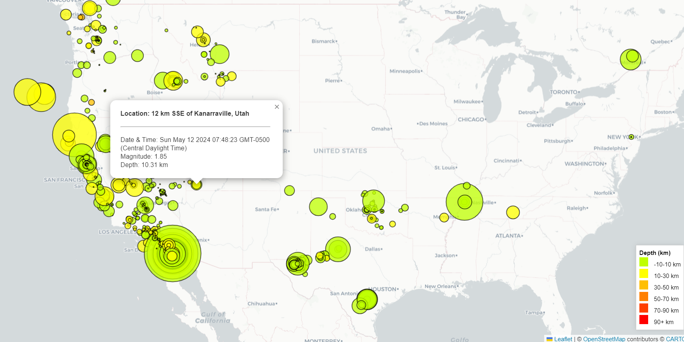
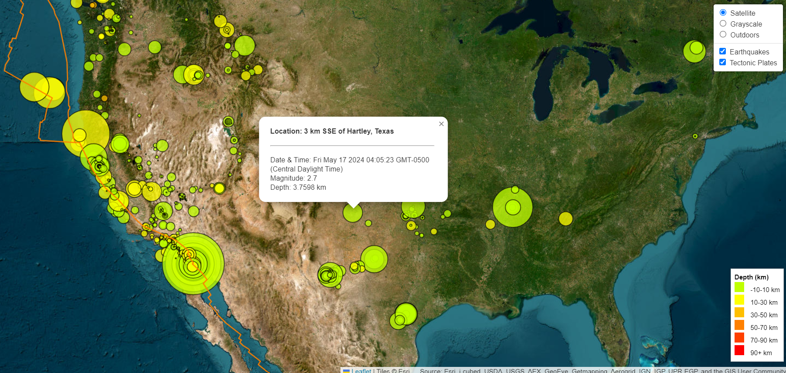

# Earthquake and Tectonic Plates Visualization

## Overview

The Earthquake and Tectonic Plates Visualization project is designed to provide an interactive and educational tool that illustrates the global distribution of earthquakes and their relationship with tectonic plate boundaries. Using up-to-date data from the United States Geological Survey (USGS), this web-based application enables users to visualize the magnitude, depth, and location of earthquakes in real-time. Additionally, it includes a layer showing tectonic plate boundaries, offering valuable insights into the geological forces that influence seismic activity.

This application serves both educational purposes and as a resource for those interested in earth sciences, geography, and natural disaster monitoring. It allows users to explore how earthquakes are distributed along plate boundaries, identify patterns, and understand the dynamic nature of the Earth's crust. Through interactive maps and customizable layers, the project aims to make complex geological data accessible and understandable to a wide audience.

Whether for academic use, disaster preparedness, or general curiosity, this visualization tool provides a powerful way to connect with and learn about one of nature's most formidable forces.


### Purpose

The primary purpose of the Earthquake and Tectonic Plates Visualization project is to enhance public understanding and awareness of seismic activities and their geological context through accessible and interactive mapping technologies. This project aims to:

- **Educate Users**: Provide an educational platform for students, researchers, and the general public to learn about seismic activities, their impacts, and their correlation with tectonic plates.
- **Facilitate Research**: Serve as a tool for geologists and researchers studying earthquake patterns and their relationship with plate tectonics, enabling the visualization of historical and real-time data.
- **Promote Preparedness**: Increase earthquake preparedness by informing the public about frequent seismic zones and historical earthquake activity, potentially aiding in risk management and disaster readiness planning.
- **Encourage Interaction**: Allow users to interact with the data through a web-based interface that supports engagement and deeper exploration of complex datasets, making the study of earth sciences more approachable.

This visualization tool is designed not only to provide real-time data but also to contextualize that data within the broader geological phenomena, thereby helping users make informed decisions and fostering a greater appreciation for the dynamic nature of Earth’s geophysical processes.


### Scope

The Earthquake and Tectonic Plates Visualization project is scoped to offer a comprehensive yet specific set of functionalities aimed at representing seismic data and geological features effectively. The scope of this project includes:

- **Data Representation**: Visualization of real-time and historical earthquake data globally, including magnitude, depth, and exact locations of seismic events.
- **Geological Features**: Integration of tectonic plate boundaries data to illustrate the relationship between seismic activity and geological structures.
- **User Interaction**: Implementation of interactive map features such as zoom, toggle between different map layers, and clickable markers for detailed information on specific earthquakes.
- **Educational Tool**: Provision of a legend and detailed pop-ups that explain the significance of the data points, catering to educational purposes for students and enthusiasts.
- **Technical Limitations**: The project is web-based and requires internet access for real-time data updates. It is dependent on external APIs for earthquake and tectonic plates data, which could affect availability and performance.
- **Geographical Coverage**: While the tool aims to cover global data, the resolution and frequency of updates may vary by region based on the data provided by USGS and other sources.
- **Future Enhancements**: Potential future expansions include incorporating additional geological datasets, improving mobile responsiveness, and adding user customization features such as saving favorite locations or receiving alerts.

This scope is designed to balance between technical feasibility and user engagement, ensuring that the tool remains informative, reliable, and easy to use for a wide audience.


### Objectives

The objectives of the Earthquake and Tectonic Plates Visualization project are designed to provide a comprehensive and engaging experience for users interested in geoscience, particularly in the area of seismology. The key objectives include:

- **Visualizing Seismic Data**: To dynamically display real-time and historical earthquake data on a global scale, including details such as magnitude, depth, and location.
- **Integrating Geological Context**: To overlay tectonic plate boundaries on the map, providing a contextual understanding of where and why earthquakes occur relative to these geological features.
- **Enhancing User Experience**: To ensure the map and its features are intuitive and accessible for users of all levels, from students to professional geologists, enhancing their ability to interact with and interpret the data.
- **Promoting Educational Outreach**: To serve as an educational tool in classrooms and public science events, helping to explain complex geological processes in a visually engaging way.
- **Supporting Research and Preparedness**: To aid researchers in analyzing seismic activity patterns and help communities in earthquake-prone areas prepare by making information readily accessible and understandable.
- **Ensuring Scalability and Sustainability**: To develop the project with scalable architecture, allowing for future expansions such as additional data layers or enhanced analytical tools without compromising performance.

By achieving these objectives, the project aims to make a significant impact on the public’s understanding of earthquakes and their effects, fostering greater awareness and preparedness for natural disasters.

## Setup and Installation

Setting up the Earthquake and Tectonic Plates Visualization project on your local machine is straightforward. Follow these steps to get started:

### Prerequisites

- A modern web browser such as Google Chrome, Firefox, Safari, or Edge.
- Internet access for loading map tiles and fetching real-time data.

### Installation Steps

1. **Clone the Repository**
   - Use Git to clone the repository to your local machine. If you do not have Git installed, you can download it from [Git's website](https://git-scm.com/downloads).
   ```bash
   git clone https://github.com/NataliiaShevchenko620/leaflet-challenge.git
   cd leaflet-challenge
   ```

## Project Structure

The Earthquake and Tectonic Plates Visualization project is organized into a simple structure that makes it easy to manage and understand. Here's a breakdown of the key components:

- `Leaflet-Part-1/`: the simple version of the project that shows all earthquakes from the last week on the standard OpenSteet map
  - `static/`: 
    - `css`: 
      - `styles.css`: additional styles to meet the requirements for color of HTML elements
    - `js`
      - `app.js`: JavaScript applicaiton code that performs all the logic

  - `index.html`: a web page with interactive analytics
- `Leaflet-Part-2/`: the advanced version of the analytics that also visualizes tectonic plates (and allows to enable/disable such layer) and allows to switch between 3 types of maps: Satellite, Grayscale and Outdoor
  - `static/`: 
    - `css`: 
      - `styles.css`: additional styles to meet the requirements for color of HTML elements
    - `js`
      - `app.js`: JavaScript applicaiton code that performs all the logic

  - `index.html`: a web page with interactive analytics

## Usage

The Earthquake and Tectonic Plates Visualization tool is designed to be intuitive and user-friendly. Here’s how to navigate and use the various features of the interactive map:

### Exploring the Map

- **Viewing Earthquakes**: Earthquakes are displayed as circles on the map. The size of each circle represents the magnitude of the earthquake, and the color indicates the depth.
- **Toggling Layers**: Use the layer control located in the top right corner of the map to switch between different map backgrounds (e.g., Satellite and Grayscale) and to toggle the visibility of earthquakes and tectonic plates layers.
- **Zooming and Panning**: Use your mouse or touchpad to zoom in and out of the map for a closer look at specific areas. Click and drag to pan across the map.



### Getting Detailed Information

- **Earthquake Details**: Click on any earthquake marker to open a popup that provides detailed information about that earthquake, including location, magnitude, depth, and the exact time of occurrence.
- **Tectonic Plates**: The tectonic plates layer shows the boundaries of the Earth’s plates. This layer can be enabled or disabled through the layer control. Understanding these boundaries can help correlate the locations of earthquakes with plate boundaries.



### Customizing the View

- **Layer Selection**: Adjust which layers are visible at any time to customize the map to show only the information you are interested in.
- **Map Styles**: Choose between different map styles (Satellite or Grayscale) to suit your preference or to enhance visibility of the map markers and layers.

### Educational and Research Use

- **Classroom Use**: Educators can use the map in lessons about geology, specifically teaching about earthquakes, tectonic movements, and geophysical processes.
- **Research Tool**: Researchers can use the real-time data provided by the map for studies on seismic activity and tectonic interactions.

This interactive tool is equipped to provide both general insights into global seismic activity and detailed data suitable for more in-depth analysis and educational purposes.


## License

This project is licensed under the MIT License.

### MIT License Summary

The MIT License is a permissive license that is short and to the point. It lets people do anything they want with your code as long as they provide attribution back to you and don’t hold you liable.

#### Permissions

- Commercial use
- Modification
- Distribution
- Private use

#### Conditions

- Include copyright and license notice

#### Limitations

- No Liability
- No Warranty


